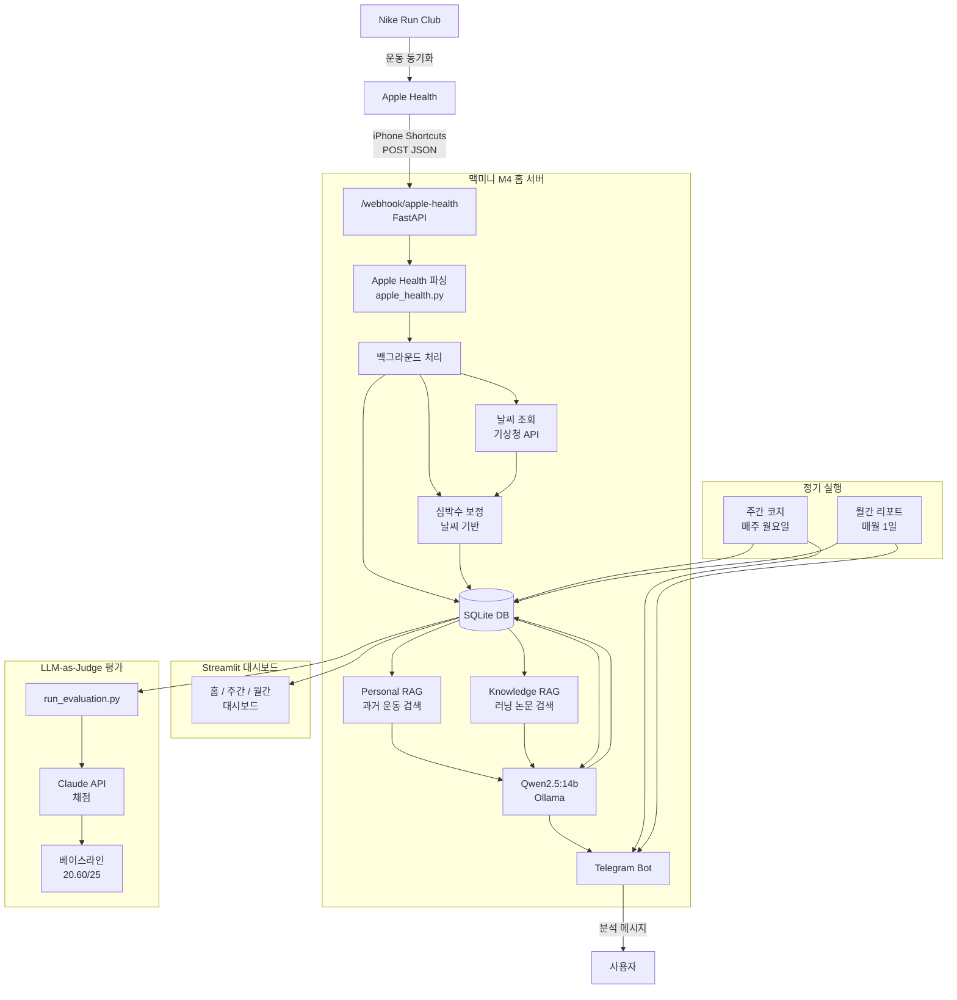

# Running Coach AI

맥미니 M4 홈 서버에서 로컬 LLM(Qwen2.5:14b)으로 구동하는 개인화 러닝 코치.

- Apple Health(iPhone Shortcuts) → FastAPI Webhook으로 운동 데이터 수신
- Qwen2.5:14b(Ollama)로 운동 분석 및 코칭 메시지 생성
- Personal RAG + Knowledge RAG로 과거 기록 및 러닝 지식 검색
- Telegram Bot으로 분석 결과 자동 발송
- Streamlit 대시보드로 훈련 현황 시각화

## 기술 스택

| 영역 | 기술 |
|------|------|
| 백엔드 | FastAPI + SQLite |
| LLM | Qwen2.5:14b (Ollama) |
| 평가 | Claude API (LLM-as-Judge) |
| RAG | ChromaDB + sentence-transformers |
| 대시보드 | Streamlit |
| 인프라 | macOS launchd + ngrok |

## 디렉토리 구조

```
running-coach-ai/
├── app/
│   ├── main.py                 # FastAPI 엔트리포인트, Webhook 수신
│   ├── config.py               # 환경변수 로드
│   ├── ai/
│   │   ├── local_llm.py        # Qwen/Ollama 운동 분석
│   │   └── claude.py           # Claude API (LLM-as-Judge 전용)
│   ├── coaches/
│   │   ├── weekly_coach.py     # 주간 훈련 계획 생성
│   │   └── monthly_coach.py    # 월간 리포트 생성
│   ├── core/
│   │   └── logger.py           # 공통 로거
│   ├── models/
│   │   ├── activity.py         # Pydantic 모델 (ActivityData, SplitData)
│   │   └── database.py         # SQLite CRUD
│   ├── rag/
│   │   ├── personal_rag.py     # 과거 운동 기록 검색
│   │   └── knowledge_rag.py    # 러닝 지식(논문) 검색
│   └── services/
│       ├── apple_health.py     # Apple Health JSON 파싱
│       ├── strava.py           # Strava API (비활성화)
│       ├── telegram.py         # Telegram Bot 발송
│       ├── weather.py          # 기상청 날씨 API
│       └── scheduler.py        # 주간/월간 스케줄러
├── evaluation/
│   ├── rubric.py               # LLM-as-Judge 평가 기준
│   ├── run_evaluation.py       # 평가 파이프라인 실행
│   ├── build_test_cases.py     # 테스트 케이스 생성
│   └── baseline_results.md     # 베이스라인 결과 (20.60/25)
├── scripts/
│   ├── sync_history.py         # 과거 데이터 동기화
│   ├── backfill_analysis.py    # ai_analysis_json 백필
│   ├── build_personal_rag.py   # Personal RAG 인덱싱
│   ├── build_knowledge_rag.py  # Knowledge RAG 인덱싱
│   └── download_papers.py      # 러닝 논문 다운로드
├── main.py                     # Streamlit 대시보드 엔트리포인트
├── data/
│   └── running_coach.db        # SQLite DB
└── logs/                       # 서비스별 로그
```

## 시스템 흐름도



## 실행 방법

### 환경변수 설정

```bash
cp .env.example .env
# .env 파일에 아래 값 설정
# TELEGRAM_BOT_TOKEN, TELEGRAM_CHAT_ID
# CLAUDE_API_KEY
# WEATHER_API_KEY
# APPLE_HEALTH_SECRET
```

### 서버 실행

```bash
# FastAPI 서버
uv run uvicorn app.main:app --host 0.0.0.0 --port 8000

# Streamlit 대시보드
uv run streamlit run main.py

# Ollama (Qwen2.5:14b)
ollama serve
ollama pull qwen2.5:14b
```

### RAG 인덱싱

```bash
# 과거 운동 데이터 인덱싱
uv run python scripts/build_personal_rag.py

# 러닝 지식 인덱싱
uv run python scripts/build_knowledge_rag.py
```

### 평가 실행

```bash
uv run python evaluation/run_evaluation.py
```

## Apple Health 연동 (iPhone Shortcuts)

운동 종료 시 자동으로 서버에 데이터를 전송하는 iOS 단축어 자동화:

1. **트리거**: 달리기 운동 종료 시
2. **건강 샘플 찾기**: 걷기+달리기 거리, 최신 1개
3. **세부사항 가져오기**: 시작일 → ISO 8601 포맷
4. **세부사항 가져오기**: 거리 값
5. **URL 콘텐츠 가져오기**: POST `/webhook/apple-health`
   - Header: `X-Apple-Health-Secret`
   - Body: `source, name, start_date, distance_km`

## 평가 결과 (베이스라인)

| 항목 | 점수 |
|------|------|
| 총점 | 20.60 / 25 |
| 개인화 | 1.90 / 5 (최대 약점) |
| 존3 정확성 | 3.14 / 5 |
| 안전성 | 4.50 / 5 |
| 실행 가능성 | 4.80 / 5 |

> 개인화 개선 목표: Personal RAG 구현으로 과거 기록 기반 맞춤 코칭
